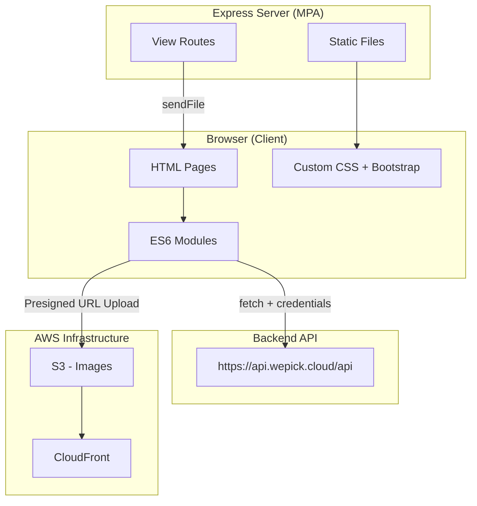
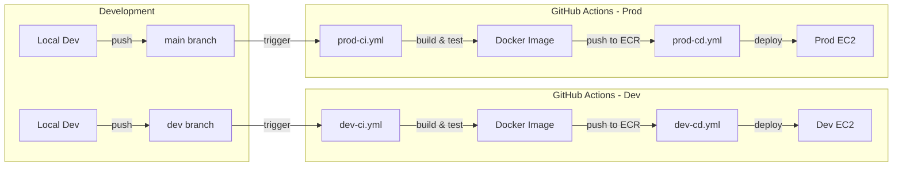
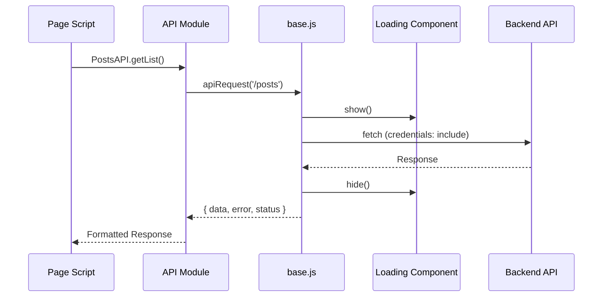
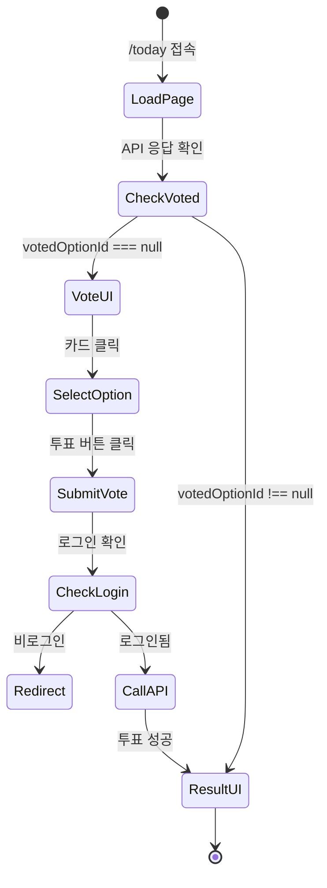
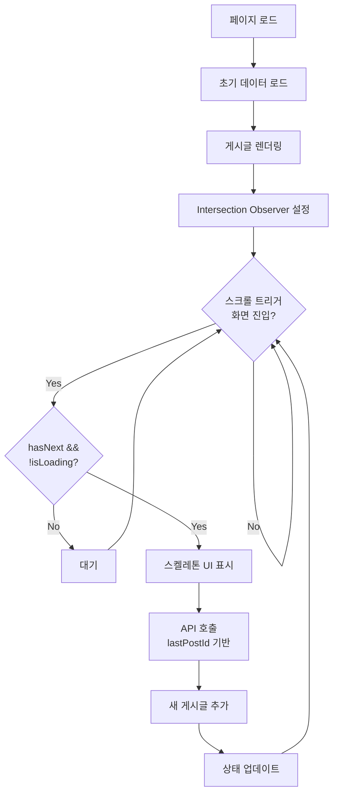
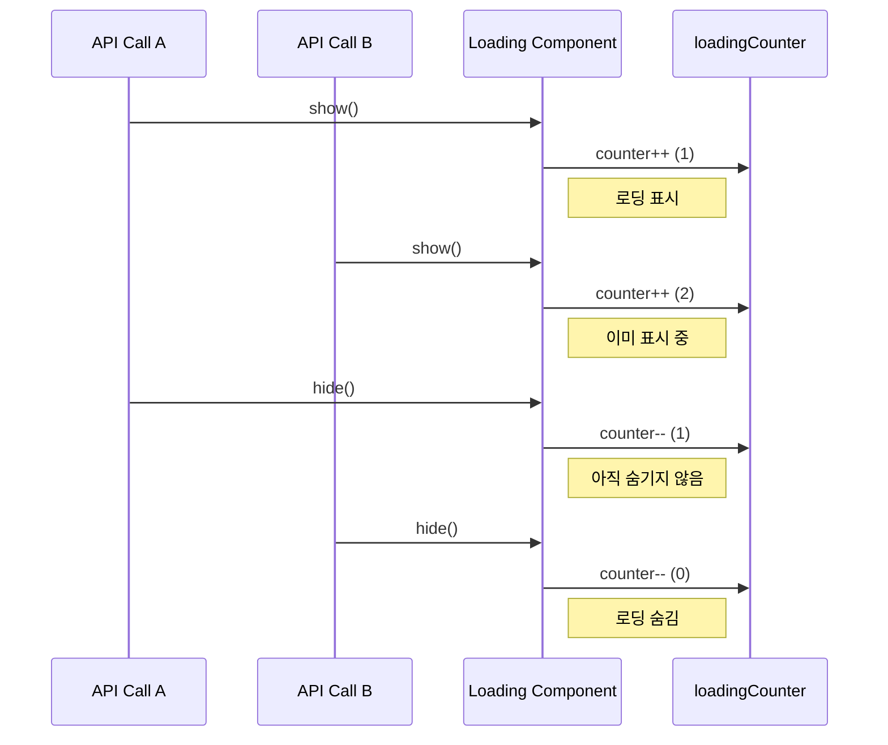
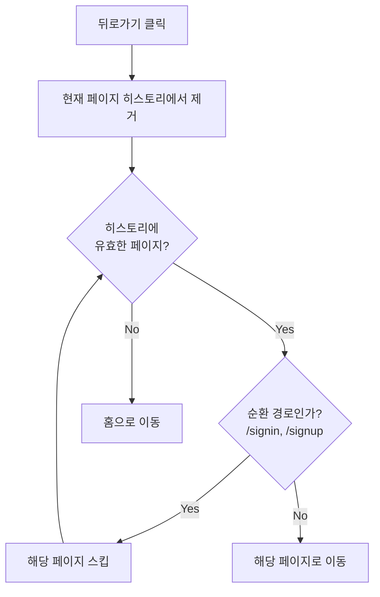

# WePick Frontend


> 매일 새로운 A/B 투표와 커뮤니티 기능을 제공하는 프론트엔드 웹 애플리케이션


---

## 목차

1. [Project Introduction](#1-project-introduction)
2. [Frontend Architecture](#2-frontend-architecture)
3. [Internal Logic & Design System](#3-internal-logic--design-system)
4. [Key Technical Challenges](#4-key-technical-challenges)
5. [Documentation](#5-documentation)

---

## 1. Project Introduction

### What is WePick?

**WePick**은 매일 하나의 양자택일(A/B) 투표 주제를 제공하고, 사용자들이 커뮤니티에서 의견을 나눌 수 있는 플랫폼의 프론트엔드 애플리케이션입니다.

### Core Values

| Value             | Description                                                           |
| ----------------- | --------------------------------------------------------------------- |
| **Intuitive UX**  | 페이지 새로고침 없는 동적 UI 전환으로 자연스러운 사용자 경험 제공     |
| **Mobile First**  | 모바일 최적화된 반응형 디자인과 터치 친화적 인터페이스                |
| **Fast Response** | Intersection Observer 기반 무한 스크롤과 스켈레톤 UI로 체감 속도 개선 |

### Key Features

```
[Vote]      오늘의 토픽 조회 → A/B 선택 → 투표 → 실시간 결과 확인 (페이지 이동 없이)
[Post]      게시글 CRUD → 댓글 → 좋아요 → 무한 스크롤 페이지네이션
[Auth]      회원가입 → 로그인(HTTP-only Cookie) → 프로필 관리
[Image]     Presigned URL → S3 직접 업로드 → 즉시 미리보기
```

### Screenshots

|                   Landing Page                    |                 Today's Vote                 |                       Community                       |
| :-----------------------------------------------: | :------------------------------------------: | :---------------------------------------------------: |
|  |  |  |

---

## 2. Frontend Architecture

### System Overview



### Architecture Components

| Component          | Technology                 | Purpose                            |
| ------------------ | -------------------------- | ---------------------------------- |
| **Runtime**        | Express 5.1                | HTML 페이지 제공 (MPA View Router) |
| **JavaScript**     | ES6 Modules                | 클라이언트 사이드 로직, API 연동   |
| **Styling**        | Custom CSS + Bootstrap 5.3 | 디자인 토큰 기반 스타일링          |
| **Authentication** | HTTP-only Cookie           | 보안 토큰 관리 (서버 자동 처리)    |
| **Image Upload**   | S3 Presigned URL           | 클라이언트 직접 업로드             |

### CI/CD Pipeline



| Branch | Workflow                      | Target                     |
| ------ | ----------------------------- | -------------------------- |
| `dev`  | `dev-ci.yml` → `dev-cd.yml`   | Development 환경 자동 배포 |
| `main` | `prod-ci.yml` → `prod-cd.yml` | Production 환경 자동 배포  |

---

## 3. Internal Logic & Design System

### Architecture Style: Feature-Based MPA

단일 페이지 앱(SPA)이 아닌 **Multi-Page Application** 구조를 채택했습니다. 각 기능(Feature)별로 독립적인 HTML/JS/CSS를 가지며, 공유 모듈을 통해 일관성을 유지합니다.

```
public/
├── features/                    # Feature-Based 구조
│   ├── posts/                   # 커뮤니티 (게시판)
│   │   ├── pages/               # HTML 페이지
│   │   ├── scripts/             # JavaScript 모듈
│   │   └── styles/              # CSS 스타일
│   │
│   ├── users/                   # 사용자 인증 & 관리
│   │   ├── pages/
│   │   ├── scripts/
│   │   └── styles/
│   │
│   ├── wepick/                  # WePick 코어 (투표)
│   │   ├── pages/
│   │   ├── scripts/
│   │   └── styles/
│   │
│   └── error/                   # 에러 페이지
│
├── shared/                      # 공유 모듈
│   ├── api/                     # API 통신 모듈
│   │   ├── base.js              # HTTP 요청 핸들러
│   │   ├── users.js             # 사용자 API
│   │   ├── posts.js             # 게시글 API
│   │   ├── topics.js            # 투표 토픽 API
│   │   └── images.js            # 이미지 업로드 API
│   │
│   ├── components/              # 공통 UI 컴포넌트
│   │   ├── header.html/js       # 전역 헤더
│   │   ├── footer.html/js       # 전역 푸터
│   │   ├── loading.js           # 로딩 인디케이터
│   │   ├── gauge-bar.js         # 투표 게이지 바
│   │   └── toast.js             # 토스트 알림
│   │
│   ├── utils/                   # 유틸리티 함수
│   │   ├── auth.js              # 인증 관리
│   │   ├── validation.js        # 폼 유효성 검사
│   │   ├── navigation.js        # 페이지 네비게이션
│   │   ├── dom.js               # DOM 조작
│   │   └── config.js            # 중앙 설정
│   │
│   └── styles/                  # 공통 스타일
│       ├── custom.css           # 디자인 토큰
│       └── header.css           # 헤더 스타일
│
routes/                          # Express View 라우터
assets/                          # 정적 이미지/아이콘
```

### Design Philosophy

#### 1. Centralized API Handler

모든 API 요청은 `base.js`를 통해 일관되게 처리됩니다.



**Why?**

- 중앙 집중식 에러 처리 (401, 403, 404, 500)
- 자동 로딩 인디케이터 표시/숨김
- HTTP-only 쿠키 자동 전송 (`credentials: 'include'`)
- 일관된 응답 형식 반환

#### 2. Action-Based Authentication

페이지 진입 시 무조건 인증 체크를 하지 않고, **행위(Action) 기준**으로 로그인을 요구합니다.

| 행위      | 인증 요구 시점      |
| --------- | ------------------- |
| 투표하기  | 투표 버튼 클릭 시   |
| 글 작성   | 작성 버튼 클릭 시   |
| 댓글 작성 | 댓글 제출 시        |
| 좋아요    | 좋아요 버튼 클릭 시 |

**Benefits:**

- 비로그인 사용자도 콘텐츠 탐색 가능
- 필요한 순간에만 로그인 유도
- 더 나은 사용자 경험 제공

#### 3. Design Token System

CSS 변수를 통한 일관된 디자인 시스템을 적용했습니다.

```css
:root {
  /* 색상 */
  --bs-primary: #3b82f6;
  --bs-body-color: #1f2937;
  --color-text-muted: #9ca3af;

  /* 폰트 크기 */
  --font-size-sm: 0.875rem;
  --font-size-base: 1rem;
  --font-size-lg: 1.125rem;

  /* 간격 */
  --spacing-sm: 0.5rem;
  --spacing-md: 1rem;
  --spacing-lg: 1.5rem;

  /* 테두리 */
  --bs-border-radius: 8px;
  --bs-border-radius-lg: 12px;

  /* 애니메이션 */
  --transition-fast: 0.15s ease;
}
```

---

## 4. Key Technical Challenges

### Challenge 1: Dynamic Vote UI Transition

**Problem**: 투표 전/후 화면 전환 시 페이지 새로고침이 발생하면 사용자 경험이 끊김

**Solution**: 같은 페이지(`/today`)에서 JavaScript로 UI 상태를 동적으로 전환



| 구분        | Before               | After                  |
| ----------- | -------------------- | ---------------------- |
| 화면 전환   | 페이지 리다이렉트    | DOM 조작으로 즉시 전환 |
| 체감 속도   | ~500ms (페이지 로드) | ~50ms (UI 전환)        |
| 사용자 경험 | 화면 깜빡임 발생     | 자연스러운 애니메이션  |

**Benefits:**

- 페이지 새로고침 없이 즉각적인 피드백
- 게이지 바 애니메이션으로 결과 시각화
- 로그아웃 시에도 투표 UI로 자동 전환

---

### Challenge 2: Infinite Scroll with Performance Optimization

**Problem**: 게시글 목록에서 전통적인 페이지네이션은 모바일 UX에 적합하지 않음

**Solution**: Intersection Observer + 커서 기반 페이지네이션 + 스켈레톤 UI



**Implementation Details:**

```javascript
// Intersection Observer 설정
const observer = new IntersectionObserver(
  (entries) => {
    if (entry.isIntersecting && state.hasNext && !state.isLoading) {
      loadPosts();
    }
  },
  { rootMargin: "200px", threshold: 0.1 }
);
```

| 기법                   | 효과                                    |
| ---------------------- | --------------------------------------- |
| `rootMargin: "200px"`  | 화면 하단 200px 전에 미리 로딩 시작     |
| 커서 기반 페이지네이션 | 중복/누락 없는 일관된 데이터 로드       |
| 스켈레톤 UI            | 로딩 중에도 레이아웃 유지 (CLS 방지)    |
| `DocumentFragment`     | 다수 DOM 노드 일괄 추가로 렌더링 최적화 |

**Benefits:**

- 끊김 없는 스크롤 경험
- 체감 로딩 시간 단축
- Cumulative Layout Shift(CLS) 점수 개선

---

### Challenge 3: Nested Loading Indicator Management

**Problem**: 여러 API 호출이 동시에 발생할 때 로딩 인디케이터가 예상보다 빨리 사라지는 문제

**Solution**: 카운터 기반 중첩 로딩 상태 관리



**Implementation:**

```javascript
let loadingCounter = 0;

function show() {
  loadingCounter++;
  if (loadingCounter === 1) {
    // DOM에 로딩 오버레이 추가
  }
}

function hide() {
  loadingCounter = Math.max(0, loadingCounter - 1);
  if (loadingCounter === 0) {
    // DOM에서 로딩 오버레이 제거
  }
}
```

| 상황   | 카운터 값 | 로딩 상태 |
| ------ | --------- | --------- |
| A 시작 | 1         | 표시      |
| B 시작 | 2         | 유지      |
| A 종료 | 1         | 유지      |
| B 종료 | 0         | 숨김      |

**Benefits:**

- 병렬 API 호출 시 안정적인 로딩 상태 관리
- 사용자에게 일관된 로딩 피드백 제공
- `reset()` 함수로 비정상 상황 복구 가능

---

### Challenge 4: Safe Navigation with Circular Reference Prevention

**Problem**: 로그인/회원가입 페이지 간 뒤로가기 시 순환 이동 발생

**Solution**: SessionStorage 기반 히스토리 추적 + 순환 경로 필터링



**Implementation:**

```javascript
const CIRCULAR_PATHS = ["/users/signin", "/users/signup"];

function goBack() {
  const history = getHistory();

  while (history.length > 0) {
    const prevPath = history.pop();

    // 순환 경로가 아닌 유효한 페이지 찾기
    if (!isCircularPath(prevPath)) {
      window.location.href = prevPath;
      return;
    }
  }

  // 유효한 이전 페이지 없으면 홈으로
  window.location.href = config.ROUTES.HOME;
}
```

| 히스토리              | 현재 위치       | 뒤로가기 결과          |
| --------------------- | --------------- | ---------------------- |
| `/posts` → `/signin`  | `/signup`       | `/posts` (로그인 스킵) |
| `/signin`             | `/signup`       | `/` (홈으로)           |
| `/posts` → `/posts/1` | `/posts/create` | `/posts/1`             |

**Benefits:**

- 로그인/회원가입 순환 이동 방지
- 최대 20개 히스토리 유지 (메모리 효율)
- 비정상 히스토리 시 안전하게 홈으로 이동

---

## 5. Documentation

### Project Documents

| Document          | Description              | Link                                     |
| ----------------- | ------------------------ | ---------------------------------------- |
| PRD               | 제품 요구사항 명세       | [docs/prd.md](./docs/prd.md)             |
| CHANGELOG         | 변경 이력                | [docs/CHANGELOG.md](./docs/CHANGELOG.md) |
| Development Guide | 개발 가이드 (AI Agent용) | [Agents.md](./Agents.md)                 |

### External Resources

| Resource                   | Link                                                                                                                           |
| -------------------------- | ------------------------------------------------------------------------------------------------------------------------------ |
| API 명세서 (Google Sheets) | [Link](https://docs.google.com/spreadsheets/d/14p7ppmWjfA4FWeHc4dvRo8pL8MjHQtqkd7Q5522O754/edit?gid=1878554884#gid=1878554884) |
| ERD 다이어그램             | [ERDCloud](https://www.erdcloud.com/d/w4FDHBTdYa74Jp4vn)                                                                       |
| Backend Repository         | [3-ellim-lee-community-be](https://github.com/100-hours-a-week/3-ellim-lee-community-be)                                       |

---

## Tech Stack

| Category     | Technology     | Version |
| ------------ | -------------- | ------- |
| Language     | JavaScript     | ES6+    |
| Runtime      | Node.js        | -       |
| Framework    | Express        | 5.1.0   |
| UI Framework | Bootstrap      | 5.3.8   |
| Testing      | Jest           | 30.2.0  |
| Build        | Docker         | -       |
| CI/CD        | GitHub Actions | -       |

---

## Branch Strategy

| Branch      | Purpose           |
| ----------- | ----------------- |
| `main`      | Production 릴리스 |
| `dev`       | Development 통합  |
| `feature/*` | 기능 개발         |
| `docs/*`    | 문서 작업         |
